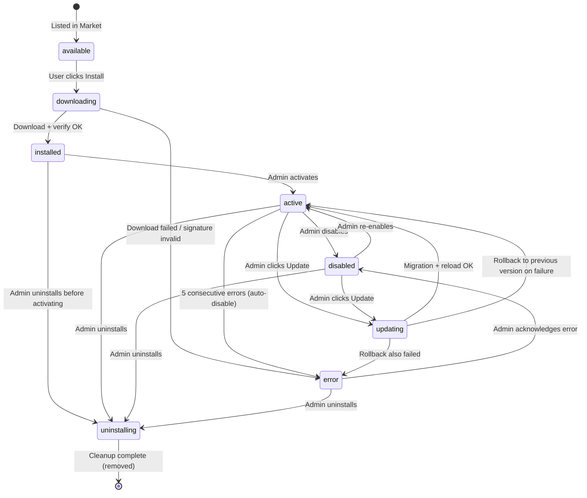

# Plugin Lifecycle Specification

**Version:** 1.0.0
**Status:** Authoritative
**Last Updated:** 2026-03-24

This document defines the complete lifecycle state machine for ADMINCHAT Panel plugins, including every valid state, transition, hot-reload process, version retention policy, health monitoring, and data lifecycle.

---

## Table of Contents

1. [State Machine Overview](#state-machine-overview)
2. [States](#states)
3. [State Transitions](#state-transitions)
4. [Hot-Reload Process](#hot-reload-process)
5. [Version Retention](#version-retention)
6. [Health Monitoring](#health-monitoring)
7. [Plugin Data Lifecycle](#plugin-data-lifecycle)
8. [Audit Log Events](#audit-log-events)

---

## State Machine Overview



---

## States

### `available`

The plugin exists in the Market catalog but is not installed on this Panel instance.

| Property | Value |
|----------|-------|
| Code on disk | No |
| Routes registered | No |
| Bot handlers active | No |
| Database tables | No |
| Config stored | No |
| Visible in Panel plugin list | No (only in Market) |

### `downloading`

The plugin bundle is being downloaded from the Market and verified. This is a transient state -- it should last only seconds.

| Property | Value |
|----------|-------|
| Code on disk | Partially (temp directory) |
| Routes registered | No |
| Bot handlers active | No |
| Database tables | No |
| Config stored | No |
| Visible in Panel plugin list | Yes (with progress indicator) |

### `installed`

The plugin bundle has been downloaded, signature-verified, and extracted to `/data/plugins/{id}/{version}/`. No code is running.

| Property | Value |
|----------|-------|
| Code on disk | Yes |
| Routes registered | No |
| Bot handlers active | No |
| Database tables | No (migrations not yet run) |
| Config stored | Default config from `config_schema` |
| Visible in Panel plugin list | Yes (with "Activate" button) |

### `active`

The plugin is fully operational. Backend routes are mounted, bot handlers are registered, frontend modules are loaded, and scheduled tasks are running.

| Property | Value |
|----------|-------|
| Code on disk | Yes |
| Routes registered | Yes |
| Bot handlers active | Yes |
| Database tables | Yes (migrations applied) |
| Config stored | Yes (admin-editable) |
| Visible in Panel plugin list | Yes (with "Disable" / "Uninstall" buttons) |
| Scheduled tasks | Running |
| WebSocket events | Publishing |

### `disabled`

The plugin is installed but not running. All runtime registrations (routes, handlers, scheduled tasks) have been removed. Data is preserved.

| Property | Value |
|----------|-------|
| Code on disk | Yes |
| Routes registered | No |
| Bot handlers active | No |
| Database tables | Yes (preserved) |
| Config stored | Yes (preserved, not editable) |
| Visible in Panel plugin list | Yes (with "Enable" / "Uninstall" buttons) |
| Scheduled tasks | Stopped |
| WebSocket events | Stopped |

### `error`

The plugin has been automatically disabled due to repeated runtime errors, or failed to load during activation or update.

| Property | Value |
|----------|-------|
| Code on disk | Yes |
| Routes registered | No |
| Bot handlers active | No |
| Database tables | Yes (preserved) |
| Config stored | Yes (preserved) |
| Visible in Panel plugin list | Yes (with error details and "Retry" / "Uninstall" buttons) |
| Error info | Last 5 error tracebacks stored |

### `updating`

A newer version is being installed while the previous version continues to run (for zero-downtime updates). This is a transient state.

| Property | Value |
|----------|-------|
| Code on disk | Yes (both old + new version) |
| Routes registered | Yes (old version still serving) |
| Bot handlers active | Yes (old version) |
| Database tables | In migration |
| Config stored | Yes |
| Visible in Panel plugin list | Yes (with progress indicator) |

### `uninstalling`

The plugin is being removed. Teardown functions are called, routes and handlers are unregistered, and optionally database tables are dropped.

| Property | Value |
|----------|-------|
| Code on disk | Being deleted |
| Routes registered | No (already unregistered) |
| Bot handlers active | No |
| Database tables | Optionally being dropped |
| Config stored | Being deleted |
| Visible in Panel plugin list | Yes (with progress indicator) |

---

## State Transitions

### 1. `available` -> `downloading`

| Property | Value |
|----------|-------|
| **Trigger** | Admin clicks "Install" on the Market page |
| **Preconditions** | Panel version within `min_panel_version` / `max_panel_version` range. No conflicting plugin active. Internet connectivity to Market. |
| **Actions** | 1. Create plugin record in `plugins` table with state `downloading`. 2. Start background download task. 3. Send WebSocket event `plugin:download_started` to admin UI. 4. Download zip bundle from Market CDN. 5. Report progress via WebSocket. |
| **Rollback on failure** | Delete plugin record. Notify admin via WebSocket with error details. Clean up temp files. |

### 2. `downloading` -> `installed`

| Property | Value |
|----------|-------|
| **Trigger** | Download completes and verification passes |
| **Preconditions** | ZIP fully downloaded. Network integrity verified (SHA-256 match). |
| **Actions** | 1. Verify SHA-256 hash of downloaded zip against Market metadata. 2. Verify Ed25519 signature of the zip. 3. Extract to `/data/plugins/{id}/{version}/`. 4. Parse and validate `manifest.json` (full validation suite -- see PLUGIN_MANIFEST_SPEC.md). 5. Install `python_dependencies` into plugin venv if declared. 6. Store default config from `config_schema` into `plugin_configs` table. 7. Update plugin record state to `installed`. 8. Send WebSocket event `plugin:installed`. 9. Write audit log entry. |
| **Rollback on failure** | Delete extracted directory. Delete plugin record. Notify admin with specific error. |

### 3. `downloading` -> `error`

| Property | Value |
|----------|-------|
| **Trigger** | Download failure, hash mismatch, or signature verification failure |
| **Preconditions** | Any verification step failed |
| **Actions** | 1. Delete partial/complete download from temp storage. 2. Update plugin record state to `error` with error details. 3. Send WebSocket event `plugin:install_failed` with error. 4. Write audit log entry (security event if signature invalid). |
| **Rollback** | N/A -- nothing to roll back. Admin can retry or uninstall the error record. |

### 4. `installed` -> `active`

| Property | Value |
|----------|-------|
| **Trigger** | Admin clicks "Activate" or initial install with auto-activate preference |
| **Preconditions** | All `required_plugins` are installed and active with compatible versions. No `conflicts_with` plugin is active. Plugin code passed integrity check. |
| **Actions** | 1. Resolve and verify all plugin dependencies. 2. Run Alembic migrations programmatically (if `database` capability). 3. Dynamically import the `entry_point` module. 4. Call `setup(sdk)` function. 5. Mount FastAPI router at `/api/v1/p/{id}/{prefix}` (if `api_routes`). 6. Register bot handlers in HotSwappableRouter (if `bot_handler`). 7. Register APScheduler jobs (if `scheduled_tasks`). 8. Notify frontend via WebSocket to load `remoteEntry.js` (if `frontend_pages`). 9. Initialize error counter to 0. 10. Update plugin state to `active`. 11. Write audit log entry. |
| **Rollback on failure** | Call `teardown(sdk)` if `setup` partially completed. Unregister any routes/handlers that were registered. Revert Alembic migrations (downgrade). Set state to `error` with error details. Notify admin. |

**Migration Rollback Detail:** If Alembic migration fails mid-way, the Panel runs `alembic downgrade` to the pre-migration revision. If downgrade also fails, the plugin enters `error` state and the admin is instructed to check the database manually.

### 5. `active` -> `disabled`

| Property | Value |
|----------|-------|
| **Trigger** | Admin clicks "Disable" in plugin management |
| **Preconditions** | No other active plugin depends on this plugin (dependency check). |
| **Actions** | 1. Call `teardown(sdk)` on the plugin module. 2. Remove FastAPI router from the app. 3. Remove bot handlers from HotSwappableRouter. 4. Cancel all APScheduler jobs for this plugin. 5. Notify frontend via WebSocket to unload plugin modules. 6. Preserve all database tables and config. 7. Update state to `disabled`. 8. Write audit log entry. |
| **Rollback on failure** | If teardown fails, force-remove registrations. Log teardown error but proceed with disable. Set state to `disabled`. |

**Dependency cascade:** If plugin B depends on plugin A, disabling A requires either: (a) disabling B first, or (b) admin confirming cascading disable of all dependents.

### 6. `disabled` -> `active`

| Property | Value |
|----------|-------|
| **Trigger** | Admin clicks "Enable" |
| **Preconditions** | Same as transition 4 (`installed` -> `active`). All dependencies still met. |
| **Actions** | Same as transition 4, except: Alembic migrations are checked but typically already applied. `setup(sdk)` is called fresh. Error counter reset to 0. |
| **Rollback on failure** | Same as transition 4. State returns to `disabled` (not `error`) on failure. |

### 7. `active` -> `error`

| Property | Value |
|----------|-------|
| **Trigger** | 5 consecutive unhandled exceptions in plugin handlers (auto-disable) |
| **Preconditions** | Error counter >= threshold (5). |
| **Actions** | 1. Perform same teardown as transition 5 (`active` -> `disabled`). 2. Store the last 5 error tracebacks in the plugin record. 3. Update state to `error`. 4. Send WebSocket notification to all admin sessions. 5. Send Telegram notification to super_admins (if configured). 6. Write audit log entry with `severity: critical`. |
| **Rollback** | N/A. Admin must manually investigate and re-enable. |

**Error counter rules:**
- Incremented on each unhandled exception in any plugin handler, route, or scheduled task.
- Reset to 0 on each successful execution.
- Only consecutive errors count (a successful execution between errors resets the counter).
- The threshold is configurable per-plugin via admin settings (default: 5).

### 8. `active` -> `updating`

| Property | Value |
|----------|-------|
| **Trigger** | Admin clicks "Update" when a newer version is available in the Market |
| **Preconditions** | New version's `manifest.json` passes all validation rules. New version's `min_panel_version` is satisfied. No breaking dependency changes (checked by comparing manifests). |
| **Actions** | 1. Update state to `updating`. 2. Download new version bundle (same process as transition 1-2). 3. Extract to `/data/plugins/{id}/{new_version}/`. 4. Validate new `manifest.json`. 5. Install new `python_dependencies` in an isolated venv. 6. Keep old version running during download and preparation. |
| **Rollback on failure** | Clean up new version directory. Restore state to `active`. Notify admin. Old version continues running uninterrupted. |

### 9. `updating` -> `active` (success)

| Property | Value |
|----------|-------|
| **Trigger** | New version download, migration, and reload all succeeded |
| **Preconditions** | New version bundle downloaded and verified. Migrations tested in a transaction preview (if possible). |
| **Actions** | 1. Call `teardown(sdk)` on the old version module. 2. Remove old version routes, handlers, and scheduled tasks. 3. Run Alembic migrations for the new version. 4. Import new version's entry point module. 5. Call `setup(sdk)` on the new version. 6. Mount new routes, handlers, and scheduled tasks. 7. Notify frontend to reload `remoteEntry.js` from new version path. 8. Mark old version directory for cleanup (keep for rollback). 9. Update plugin record with new version. State -> `active`. 10. Reset error counter to 0. 11. Write audit log entry. |
| **Rollback on failure** | Proceed to transition 10 (rollback). |

### 10. `updating` -> `active` (rollback)

| Property | Value |
|----------|-------|
| **Trigger** | New version's migration or reload failed |
| **Preconditions** | Old version directory still exists on disk. |
| **Actions** | 1. If new migrations were applied, run Alembic downgrade to previous revision. 2. If new `setup(sdk)` was called, call `teardown(sdk)` on new version. 3. Re-import old version module. 4. Call `setup(sdk)` on old version. 5. Re-mount old routes, handlers, and scheduled tasks. 6. Notify frontend to reload old version `remoteEntry.js`. 7. Delete new version directory. 8. State -> `active` (with old version). 9. Send admin notification: "Update to v{new} failed, rolled back to v{old}. Reason: {error}". 10. Write audit log entry with error details. |
| **If rollback also fails** | State -> `error`. Both version directories preserved. Admin must intervene manually. |

### 11. `active` -> `uninstalling`

| Property | Value |
|----------|-------|
| **Trigger** | Admin clicks "Uninstall" and confirms the uninstall dialog |
| **Preconditions** | No other active plugin depends on this plugin. Admin confirmed via dialog with uninstall options. |
| **Actions** | See transition 13 (shared uninstall procedure). |

### 12. `disabled` -> `uninstalling`

| Property | Value |
|----------|-------|
| **Trigger** | Admin clicks "Uninstall" from disabled state |
| **Preconditions** | Admin confirmed via dialog with uninstall options. |
| **Actions** | See transition 13 (shared uninstall procedure). Teardown is skipped since the plugin is not running. |

### 13. `uninstalling` -> `removed`

| Property | Value |
|----------|-------|
| **Trigger** | Continues from transition 11 or 12 |
| **Preconditions** | Admin has chosen uninstall options (keep_data, drop_tables). |
| **Actions** | 1. Update state to `uninstalling`. 2. If plugin was `active`: call `teardown(sdk)`, remove routes/handlers/tasks (same as transition 5). 3. Cancel any WebSocket event subscriptions. 4. If `drop_tables` selected and `keep_data` not selected: run Alembic downgrade to base (drops all plugin tables). 5. If `keep_data` selected: preserve database tables but remove from migration tracking. 6. Delete plugin config from `plugin_configs` table. 7. Delete all version directories under `/data/plugins/{id}/`. 8. Delete plugin media storage `/data/plugins/{id}/media/` (unless `keep_data`). 9. Delete plugin record from `plugins` table. 10. Notify frontend to remove sidebar items and unload modules. 11. Write audit log entry. 12. State -> removed (record deleted from DB). |
| **Rollback on failure** | If table drop fails: abort uninstall, state -> `error`, notify admin. Plugin code may still be removed; admin must reinstall if needed. |

### `error` -> `disabled`

| Property | Value |
|----------|-------|
| **Trigger** | Admin clicks "Acknowledge" or "Dismiss Error" |
| **Preconditions** | None |
| **Actions** | 1. Clear stored error tracebacks. 2. Reset error counter to 0. 3. Update state to `disabled`. 4. Write audit log entry. |

---

## Hot-Reload Process

Hot-reload enables plugin installation, activation, update, and deactivation without restarting the Panel process. This section describes the step-by-step mechanics.

### Installation Hot-Reload (available -> installed -> active)

```
Step  Action                                      Component
----  ------------------------------------------  ----------------
1     Download zip bundle from Market CDN          MarketClient
2     Verify SHA-256 hash                          BundleVerifier
3     Verify Ed25519 signature                     BundleVerifier
4     Extract to /data/plugins/{id}/{version}/     BundleExtractor
5     Validate manifest.json                       ManifestValidator
6     Create isolated venv (if python_deps)        VenvManager
7     pip install python_dependencies              VenvManager
8     Dynamic Python module import                 PluginLoader
      sys.path insert + importlib.import_module()
9     Run Alembic migration programmatically       MigrationRunner
      alembic.command.upgrade(config, "head")
10    Call setup(sdk) on entry_point module         PluginLoader
11    Mount FastAPI router dynamically              RouterManager
      app.router.routes.append(Mount(...))
12    Register in HotSwappableRouter                BotHandlerManager
      router.include_handler(handler, priority)
13    Register APScheduler jobs                     SchedulerManager
      scheduler.add_job(func, CronTrigger(...))
14    Notify frontend via WebSocket                 WebSocketManager
      event: "plugin:activated"
      payload: { id, version, sidebar, routes }
15    Frontend loads remoteEntry.js dynamically     PluginShell (React)
      __webpack_init_sharing__("default")
16    Frontend registers routes in React Router     PluginShell (React)
17    Frontend injects sidebar items                Sidebar (React)
```

### Update Hot-Reload (active -> updating -> active)

```
Step  Action                                      Component
----  ------------------------------------------  ----------------
1     Download new version bundle                  MarketClient
2     Verify hash + signature                      BundleVerifier
3     Extract to /data/plugins/{id}/{new_ver}/     BundleExtractor
4     Validate new manifest.json                   ManifestValidator
5     Create/update venv for new dependencies       VenvManager
6     -- CUTOVER BEGINS (brief disruption) --
7     Call teardown(sdk) on old version             PluginLoader
8     Remove old routes from FastAPI app            RouterManager
9     Remove old handlers from HotSwappableRouter   BotHandlerManager
10    Cancel old APScheduler jobs                   SchedulerManager
11    Import new version module                     PluginLoader
12    Run Alembic migration (old_rev -> new_rev)    MigrationRunner
13    Call setup(sdk) on new version                PluginLoader
14    Mount new FastAPI router                      RouterManager
15    Register new bot handlers                     BotHandlerManager
16    Register new APScheduler jobs                 SchedulerManager
17    -- CUTOVER ENDS --
18    Notify frontend via WebSocket                 WebSocketManager
      event: "plugin:updated"
19    Frontend unloads old remoteEntry.js            PluginShell
20    Frontend loads new remoteEntry.js              PluginShell
21    Mark old version for cleanup (retain 1 prev)  VersionManager
```

**Cutover window:** Steps 7-17 represent the brief period (typically < 2 seconds) where the plugin is not serving. During this window:
- API requests to the plugin's routes return `503 Service Unavailable` with a `Retry-After: 5` header.
- Bot messages matching the plugin's handlers are queued and replayed after cutover.
- Scheduled tasks that fire during cutover are deferred to the next interval.

### Deactivation Hot-Reload (active -> disabled)

```
Step  Action                                      Component
----  ------------------------------------------  ----------------
1     Call teardown(sdk)                            PluginLoader
2     Remove FastAPI router                         RouterManager
3     Remove bot handlers                           BotHandlerManager
4     Cancel APScheduler jobs                       SchedulerManager
5     Unload Python module (remove from sys.modules) PluginLoader
6     Notify frontend via WebSocket                 WebSocketManager
      event: "plugin:disabled"
7     Frontend removes routes                       PluginShell
8     Frontend removes sidebar items                Sidebar
9     Frontend unloads remoteEntry.js               PluginShell
```

### Dynamic FastAPI Router Mounting

The Panel uses a custom `DynamicRouteManager` that wraps FastAPI's router:

```python
class DynamicRouteManager:
    """Manages dynamic mounting/unmounting of plugin routers."""

    def mount(self, plugin_id: str, router: APIRouter, prefix: str) -> None:
        """Mount a plugin router at /api/v1/p/{plugin_id}/{prefix}."""
        mount = Mount(
            path=f"/api/v1/p/{plugin_id}/{prefix}",
            app=router,
            name=f"plugin_{plugin_id}"
        )
        self.app.router.routes.append(mount)
        # Rebuild route map for O(1) lookup
        self.app.router.routes.sort(key=lambda r: r.path)

    def unmount(self, plugin_id: str) -> None:
        """Remove a plugin's router."""
        self.app.router.routes = [
            r for r in self.app.router.routes
            if getattr(r, 'name', '') != f"plugin_{plugin_id}"
        ]
```

### HotSwappableRouter for Bot Handlers

The `HotSwappableRouter` is an aiogram Router subclass that supports dynamic handler registration:

```python
class HotSwappableRouter:
    """Manages dynamically added/removed plugin bot handlers."""

    def __init__(self):
        self._handlers: dict[str, list[HandlerRegistration]] = {}
        # plugin_id -> list of registered handlers

    def register(self, plugin_id: str, handler: Handler, priority: int) -> None:
        """Add a handler with priority ordering."""
        reg = HandlerRegistration(handler=handler, priority=priority)
        self._handlers.setdefault(plugin_id, []).append(reg)
        self._rebuild_dispatch_order()

    def unregister(self, plugin_id: str) -> None:
        """Remove all handlers for a plugin."""
        self._handlers.pop(plugin_id, None)
        self._rebuild_dispatch_order()

    def _rebuild_dispatch_order(self):
        """Sort all handlers by priority (lower = higher priority)."""
        all_handlers = []
        for handlers in self._handlers.values():
            all_handlers.extend(handlers)
        all_handlers.sort(key=lambda h: h.priority)
        self._dispatch_chain = all_handlers
```

### Frontend Module Federation Dynamic Loading

The Panel frontend shell dynamically loads plugin remote entries:

```typescript
async function loadPluginModule(
  pluginId: string,
  remoteEntryUrl: string,
  moduleName: string
): Promise<React.ComponentType> {
  // 1. Load remote entry script
  await loadScript(remoteEntryUrl);

  // 2. Initialize sharing scope
  await __webpack_init_sharing__("default");

  // 3. Get container
  const container = (window as any)[`plugin_${pluginId}`];
  await container.init(__webpack_share_scopes__.default);

  // 4. Get module factory
  const factory = await container.get(moduleName);
  const module = factory();

  return module.default;
}
```

---

## Version Retention

### Directory Structure

```
/data/plugins/
  movie-request/
    1.1.0/                    # Previous version (kept for rollback)
      manifest.json
      movie_request/
      migrations/
      dist/
    1.2.0/                    # Current active version
      manifest.json
      movie_request/
      migrations/
      dist/
    media/                    # Shared media storage (persists across versions)
      posters/
      thumbnails/
```

### Retention Policy

| Rule | Description |
|------|-------------|
| Active version | Always retained while plugin is installed |
| Previous version (N-1) | Retained for rollback capability |
| Older versions (N-2 and below) | Automatically deleted after successful activation of new version |
| Maximum retained | 2 versions (current + 1 previous) |
| Cleanup trigger | After successful transition from `updating` -> `active` |
| Cleanup failure | Logged as warning, does not affect plugin operation |

### Rollback Procedure

When an admin triggers a rollback (available from the plugin management page when a previous version exists):

1. Current version state -> `updating`.
2. `teardown(sdk)` called on current version.
3. Alembic downgrade to previous version's migration head.
4. Import previous version module.
5. `setup(sdk)` called on previous version.
6. Mount previous version routes/handlers.
7. Update plugin record to previous version.
8. State -> `active`.
9. Current version directory deleted (previous version becomes the only version).

### Media Storage

The `/data/plugins/{id}/media/` directory is shared across versions and is NOT version-specific. It is only deleted during uninstall if the admin unchecks "Keep data".

---

## Health Monitoring

### Error Counter

Each active plugin maintains an error counter tracked in memory and persisted to Redis.

```
Redis key: plugin:{id}:error_count
Redis key: plugin:{id}:last_errors (list, max 10 entries)
```

#### Counter Behavior

| Event | Counter Action |
|-------|---------------|
| Unhandled exception in API route handler | Increment +1 |
| Unhandled exception in bot message handler | Increment +1 |
| Unhandled exception in scheduled task | Increment +1 |
| Unhandled exception in WebSocket event handler | Increment +1 |
| Successful API route response (2xx) | Reset to 0 |
| Successful bot handler execution | Reset to 0 |
| Successful scheduled task completion | Reset to 0 |
| Plugin activated or re-enabled | Reset to 0 |
| Plugin error threshold reached | Trigger auto-disable |

#### Error Record Structure

```json
{
  "timestamp": "2026-03-24T10:15:30Z",
  "error_type": "RuntimeError",
  "message": "TMDB API key invalid",
  "traceback": "Traceback (most recent call last):\n  ...",
  "context": {
    "handler": "movie_request.handlers:on_message",
    "trigger": "message.received",
    "user_id": 12345
  }
}
```

### Auto-Disable Threshold

| Parameter | Default | Configurable | Description |
|-----------|---------|--------------|-------------|
| `error_threshold` | 5 | Yes (per-plugin in admin settings) | Consecutive errors before auto-disable |
| `error_window` | None | No | No time window -- purely consecutive count |
| `cooldown_period` | 5 minutes | Yes (global setting) | Minimum time between auto-disable notifications |

### Notification Channels

When a plugin is auto-disabled:

| Channel | Recipients | Content |
|---------|------------|---------|
| Panel WebSocket | All admin sessions | Real-time toast notification with plugin name and last error |
| Telegram message | Super admins (if notification bot configured) | "Plugin '{name}' auto-disabled after {n} consecutive errors. Last error: {message}" |
| Email | Super admins (if SMTP configured) | Full error report with all 5 tracebacks |
| Audit log | Permanent record | State change with all error details |

### Health Check Endpoint

Each active plugin exposes a synthetic health check at:

```
GET /api/v1/p/{plugin_id}/_health
```

Response:

```json
{
  "plugin_id": "movie-request",
  "version": "1.2.0",
  "state": "active",
  "uptime_seconds": 86400,
  "error_count": 0,
  "last_error": null,
  "handlers_registered": 3,
  "routes_registered": 5,
  "scheduled_tasks": 2
}
```

---

## Plugin Data Lifecycle

The following table shows what happens to each type of plugin data during every state transition.

### Database Tables (`plg_{id}_*`)

| Transition | Tables |
|------------|--------|
| `available` -> `downloading` | No change (don't exist) |
| `downloading` -> `installed` | No change (not yet created) |
| `installed` -> `active` | **Created** via Alembic `upgrade head` |
| `active` -> `disabled` | **Preserved** (no changes) |
| `disabled` -> `active` | **Preserved** (migration check, apply if needed) |
| `active` -> `error` | **Preserved** (no changes) |
| `active` -> `updating` | **Migrated** to new schema if needed |
| `updating` -> `active` (success) | **Migrated** (new schema applied) |
| `updating` -> `active` (rollback) | **Reverted** via Alembic `downgrade` |
| `*` -> `uninstalling` (keep_data=true) | **Preserved** |
| `*` -> `uninstalling` (drop_tables=true) | **Dropped** via Alembic `downgrade base` |

### Plugin Configuration (`plugin_configs` table)

| Transition | Config |
|------------|--------|
| `downloading` -> `installed` | **Created** with defaults from `config_schema` |
| `installed` -> `active` | **Preserved** |
| `active` -> `disabled` | **Preserved** (not editable in UI) |
| `disabled` -> `active` | **Preserved** (re-validated against schema) |
| `active` -> `updating` | **Migrated** (new defaults added, removed keys dropped) |
| `*` -> `uninstalling` | **Deleted** |

### Media Files (`/data/plugins/{id}/media/`)

| Transition | Media |
|------------|-------|
| `downloading` -> `installed` | **Created** (empty directory) |
| `active` -> `disabled` | **Preserved** |
| `active` -> `updating` | **Preserved** (shared across versions) |
| `*` -> `uninstalling` (keep_data=true) | **Preserved** |
| `*` -> `uninstalling` (keep_data=false) | **Deleted** |

### Plugin Code (`/data/plugins/{id}/{version}/`)

| Transition | Code |
|------------|------|
| `downloading` -> `installed` | **Extracted** from bundle |
| `active` -> `updating` (success) | Old version: **retained** (1 previous). Older: **deleted**. |
| `active` -> `updating` (rollback) | New version: **deleted**. Old version: **restored** as active. |
| `*` -> `uninstalling` | **Deleted** (all version directories) |

### Redis State (`plugin:{id}:*`)

| Transition | Redis Keys |
|------------|------------|
| `installed` -> `active` | **Created**: `error_count`, `last_errors`, `handler_stats` |
| `active` -> `disabled` | **Deleted** |
| `active` -> `error` | **Preserved** (for diagnostics) |
| `error` -> `disabled` | **Deleted** |
| `*` -> `uninstalling` | **Deleted** |

---

## Audit Log Events

Every state transition generates an audit log entry in the `audit_logs` table.

| Event Type | Fields Logged |
|------------|---------------|
| `plugin.downloaded` | plugin_id, version, source (market/sideload), admin_id |
| `plugin.installed` | plugin_id, version, manifest_hash, admin_id |
| `plugin.activated` | plugin_id, version, capabilities, permissions, admin_id |
| `plugin.disabled` | plugin_id, version, reason (manual/auto/dependency), admin_id |
| `plugin.auto_disabled` | plugin_id, version, error_count, last_error, trigger_handler |
| `plugin.update_started` | plugin_id, from_version, to_version, admin_id |
| `plugin.updated` | plugin_id, from_version, to_version, migration_count, admin_id |
| `plugin.update_failed` | plugin_id, from_version, to_version, error, rolled_back, admin_id |
| `plugin.rollback` | plugin_id, from_version, to_version, reason, admin_id |
| `plugin.uninstall_started` | plugin_id, version, keep_data, drop_tables, admin_id |
| `plugin.uninstalled` | plugin_id, version, tables_dropped, data_kept, admin_id |
| `plugin.error` | plugin_id, version, error_type, message, handler, severity |
| `plugin.config_changed` | plugin_id, changed_keys (names only, not values), admin_id |

### Audit Log Retention

- Plugin audit logs follow the same retention policy as core audit logs.
- Default: 90 days.
- Security events (signature failures, permission violations): 365 days.

---

## Changelog

| Version | Date | Changes |
|---------|------|---------|
| 1.0.0 | 2026-03-24 | Initial specification |
